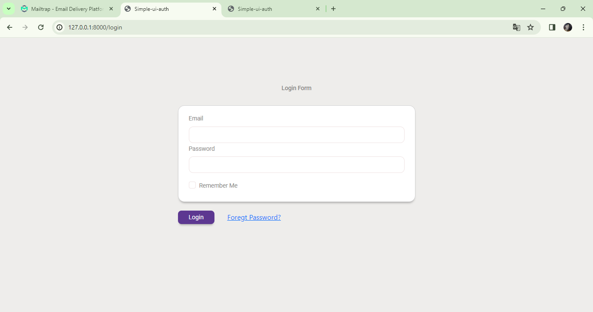
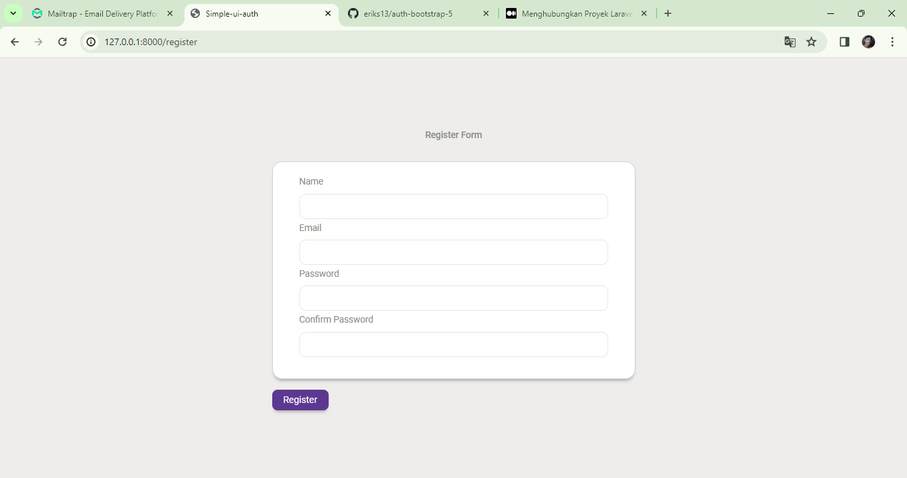
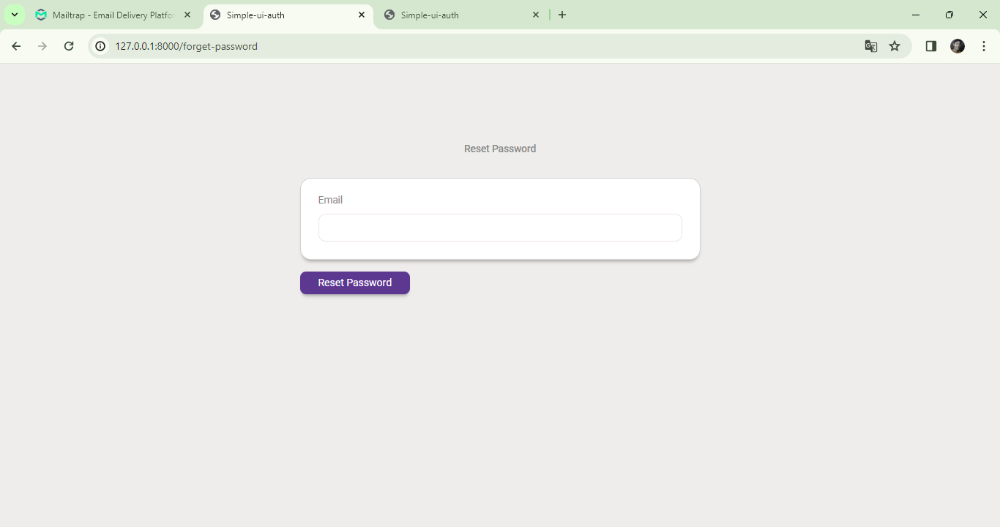
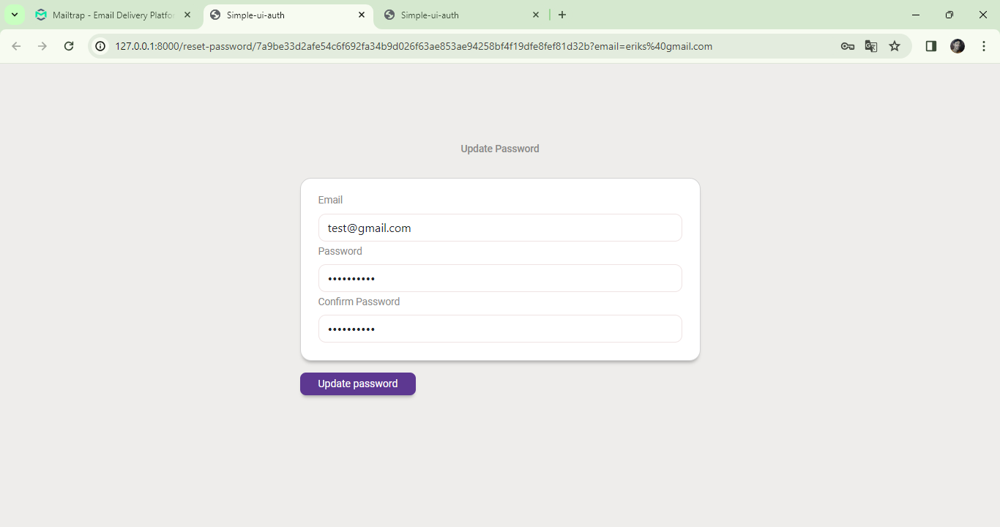
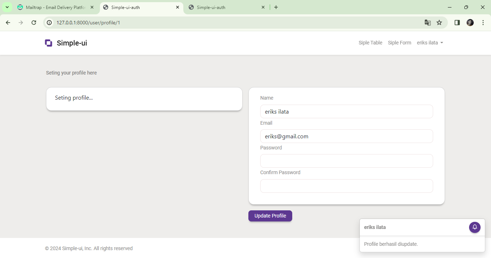
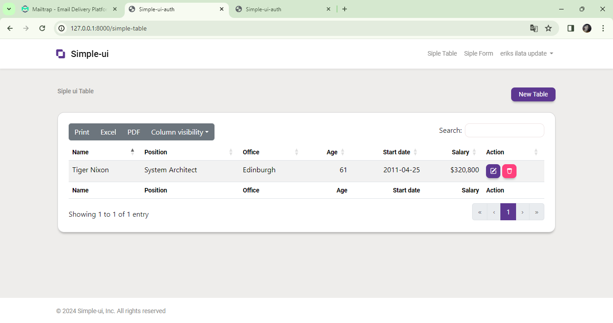

# Otentikasi Laravel 10 dengan Bootstrap 5

Repositori ini berisi sistem otentikasi Laravel 10 yang dibuat secara kustom dengan tampilan menggunakan Bootstrap 5. Ini mencakup fitur-fitur seperti login (implement remember me, ratelimiter/Login Throttling.login akan dibatasi satu menit jika gagal memberikan kredensial yang benar setelah beberapa kali mencoba. Pembatasan unik untuk nama pengguna/alamat email pengguna dan alamat IP ) registrasi, reset password via Mailtrap dan  update profile. Verifikasi email dikirim melalui Mailtrap untuk keperluan pengujian.
## Sumber referensi
1. https://laravel.com/docs/10.x/routing#rate-limiting
2. https://laravel.com/docs/10.x/authentication#authenticating-users
3. https://laravel.com/docs/10.x/authentication#password-confirmation
4. https://laravel.com/docs/10.x/passwords#introduction
5. https://laravel.com/docs/10.x/validation#form-request-validation
6. https://laravel.com/docs/10.x/validation#validation-error-response-format
7. https://laravel.com/docs/10.x/verification#events

## Fitur

- **Login**: Sistem login yang aman dengan validasi formulir dengan implementasi Ratelimiter 
- **Registrasi**: Registrasi pengguna dengan validasi formulir dan tautan verifikasi email unik yang dikirim ke alamat email yang diberikan.
- **Reset Password**: reset password via mailtrap.

## Memulai

Untuk memulai dengan sistem otentikasi Laravel ini, ikuti langkah-langkah berikut:

1. Clone repositori ke mesin lokal Anda, dengan perintah:git clone https://github.com/eriks13/auth-bootstrap-5.git
2. "cd auth-bootstrap-5" kemudian Instal dependensi Composer menggunakan `composer install`
3. Rename `.env.example` menjadi `.env` dan konfigurasi basis data dan pengaturan SMTP Mailtrap untuk keperluan reset password, verifikasi email jika ingin menerapkan ketika registrasi.
4. Buat kunci aplikasi menggunakan `php artisan key:generate`.
5. Jalankan migrasi basis data menggunakan `php artisan migrate`.
6. Mulai server pengembangan menggunakan `php artisan serve`.

## Dependensi

Proyek ini bergantung pada dependensi berikut:

- **Laravel v10**: Kerangka kerja PHP yang digunakan untuk membangun logika backend dan sistem otentikasi.
- **Bootstrap 5**: Kerangka kerja front-end yang digunakan untuk tata letak dan styling.
- **Mailtrap**: Untuk pengujian fungsi email selama pengembangan.

## Lisensi

Proyek ini bersifat open-source dan tersedia di bawah [Lisensi MIT](LICENSE).
